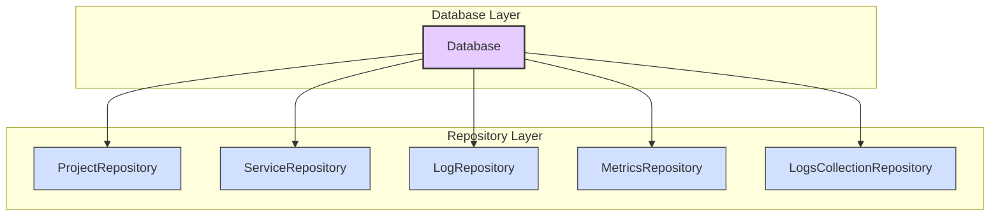
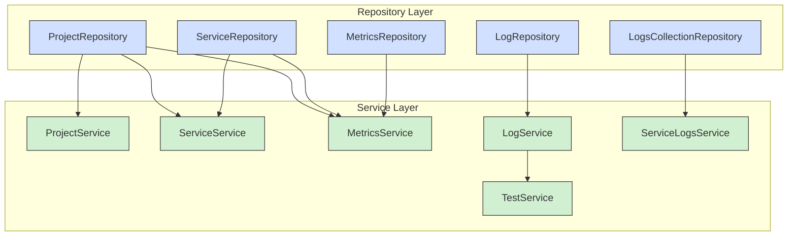
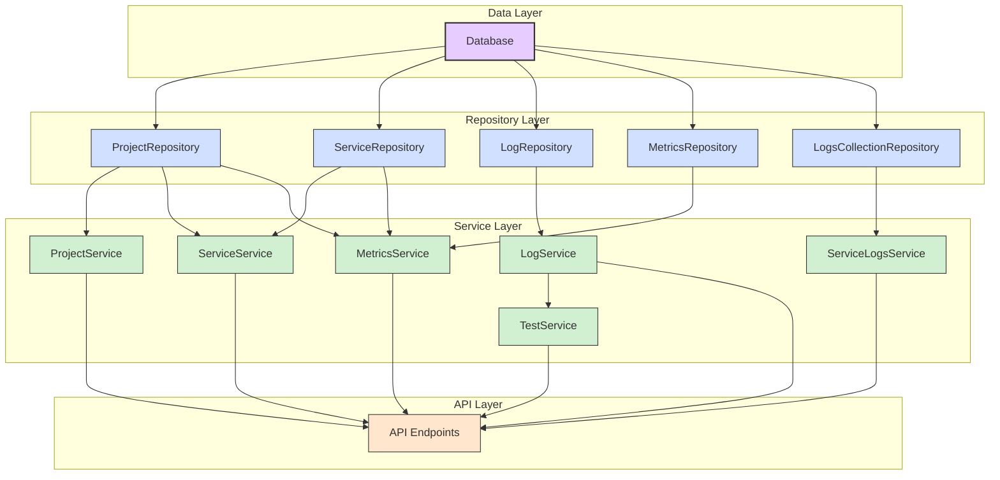
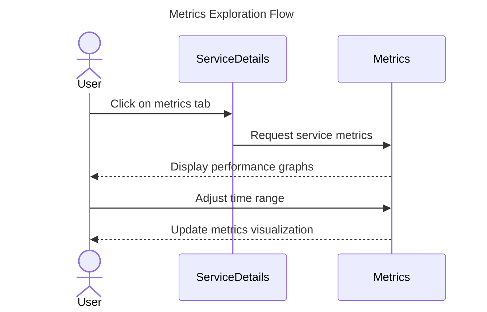
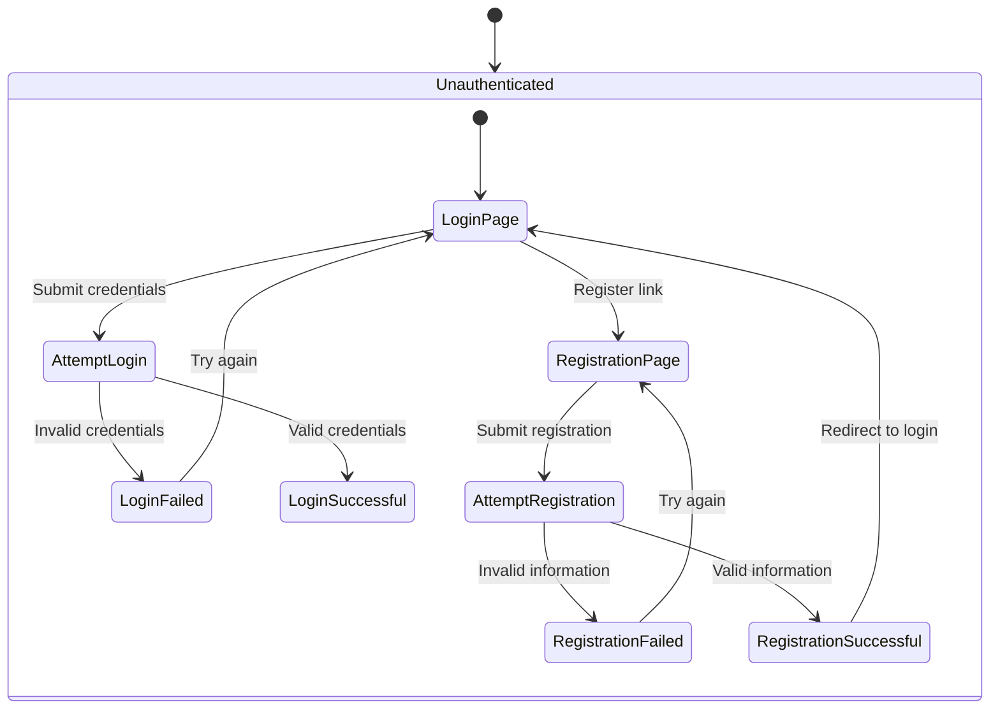
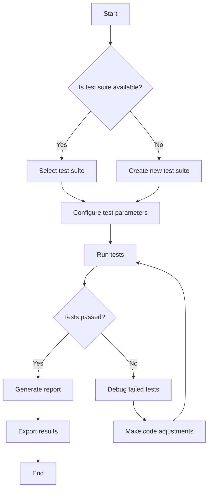
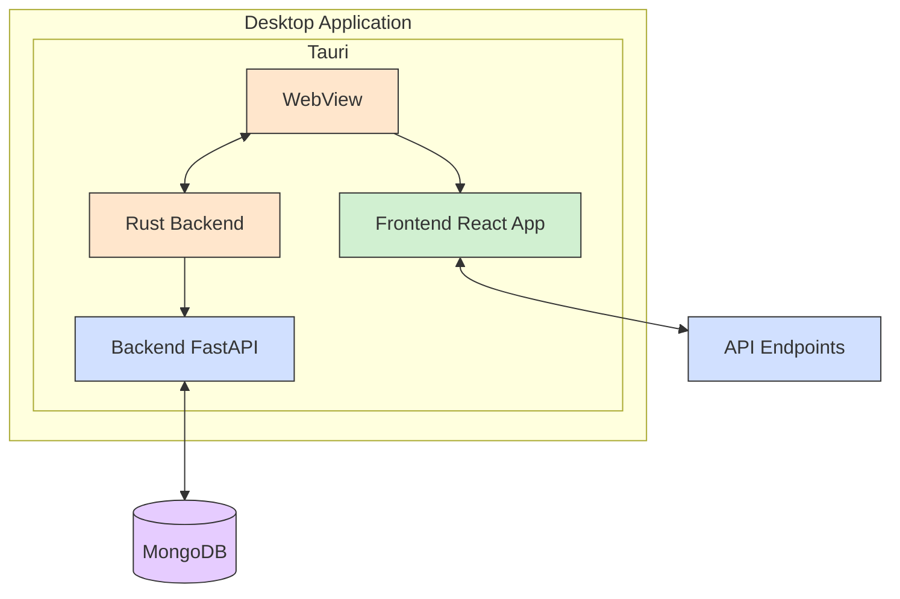

# Архітектура проекту Poly Micro Manager

## Огляд архітектури

Poly Micro Manager представляє собою комплексну систему, що складається з трьох основних компонентів:

1. **Poly Micro Backend** - серверна частина на FastAPI з MongoDB
2. **Poly Micro Frontend** - клієнтська частина на React
3. **Tauri інтеграція** - об'єднує backend і frontend в десктопний додаток

Архітектура проекту побудована за принципами мікросервісної організації з чітким розділенням відповідальностей між компонентами.

## Backend архітектура

Backend Poly Micro Manager реалізує **Layered Microservices Architecture** з чітким розділенням обов'язків:

### Архітектурні шари

1. **API Layer**: Обробляє HTTP-запити, відповіді та маршрутизацію
2. **Service Layer**: Містить бізнес-логіку та оркеструє операції
3. **Repository Layer**: Керує доступом до даних та їх збереженням
4. **Schema Layer**: Визначає структури даних та валідацію
5. **Core Layer**: Містить конфігурацію та спільні утиліти

### Діаграма залежностей репозиторіїв



### Діаграма залежностей сервісів



### Повна діаграма залежностей



## Frontend архітектура

Frontend Poly Micro Manager побудований на React з використанням сучасних патернів проектування:

### Структура компонентів

Frontend організований за принципом feature-based організації:

```
components/
├── auth/             # Функціонал аутентифікації
├── monitoring/       # Функціонал моніторингу
├── pipelining/       # CI/CD pipeline функціонал
├── testing/          # Функціонал автоматизованого тестування
└── shared/           # Спільні компоненти
```

### Патерни проектування

- **SOLID principles**: Адаптація SOLID принципів для React
- **Custom Hooks Pattern**: Відокремлення логіки від UI компонентів
- **Context API**: Глобальний стан додатку
- **Atomic Design**: Компоненти організовані за принципами атомарного дизайну

### Діаграма потоку користувача для моніторингу



### Діаграма аутентифікації користувача



### Діаграма процесу тестування мікросервісів



## Інтеграційна архітектура

Для об'єднання frontend та backend компонентів використовується Tauri framework, що дозволяє створити єдиний десктопний додаток.



## Висновки щодо архітектури

Poly Micro Manager має добре продуману архітектуру з наступними перевагами:

1. **Модульний дизайн**: Чітке розділення обов'язків робить кодову базу високо підтримуваною
2. **Масштабованість**: Stateless дизайн з контейнеризацією та кешуванням забезпечує відмінне масштабування
3. **Тестованість**: Патерн dependency injection та чіткі межі між шарами спрощують тестування
4. **Спостережуваність**: Система включає комплексну систему логування для моніторингу та дебагу
5. **Гнучкість**: Архітектура забезпечує стабільну основу для майбутньої еволюції проекту

Ця архітектура поєднує кращі практики як для backend (мікросервісна архітектура), так і для frontend (компонентний підхід з React), забезпечуючи надійну та масштабовану систему для управління мікросервісами.
